# Assignment
## Members:
SE184022 - Vo Huy Hoang  
SE183970 - Vo Khac Xuan Nguyen  
SE183990 - Dang Minh Duc  
SE183965 - Tran Nguyen Viet Thanh  

## 1. Requirements

#### Name of the system:
Storee.

#### Purpose:
Selling fashion products like shirts, pants, accessories and perfumes for MEN users.

#### Who use the system?
Customer: searching, buying, writing feedbacks about products.  
Admin: manage products and users, add new voucher, products.  

#### List of features:
User:
- Register/ Login
- Searching
- View informations about a product
- Add product to cart
- Choose payment
- Add voucher to payment (if any)
- Choose for paying methods

Admin:  
- Manage products and users (add, delete, approve products,...)
- Add new voucher to database
- Maintain the system
  

## 2. Wireframe or screenshots of the system:
> User's Page

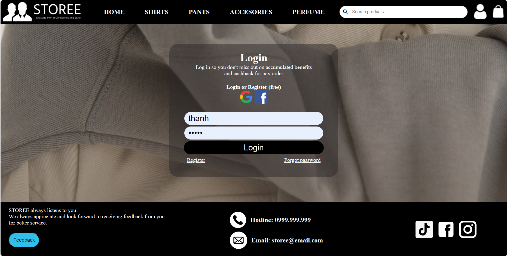
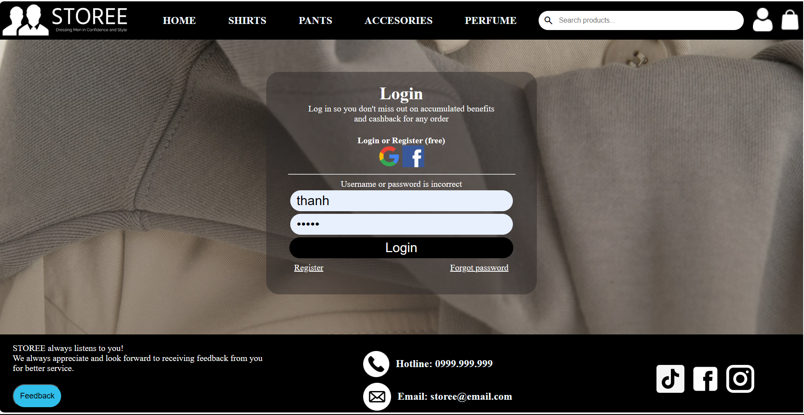
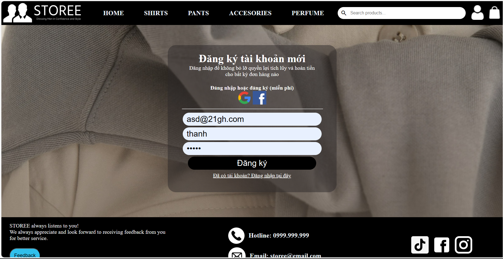
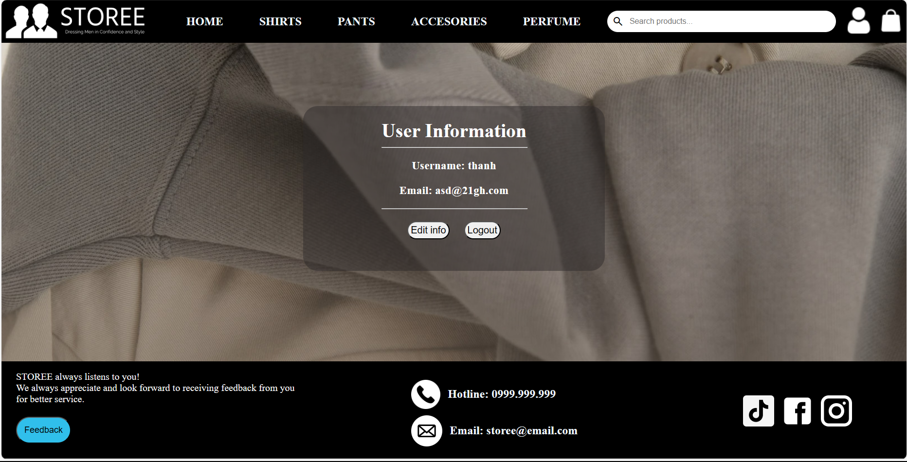
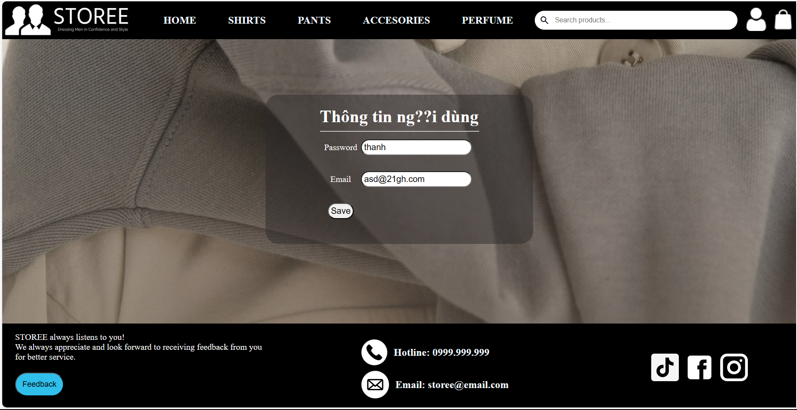
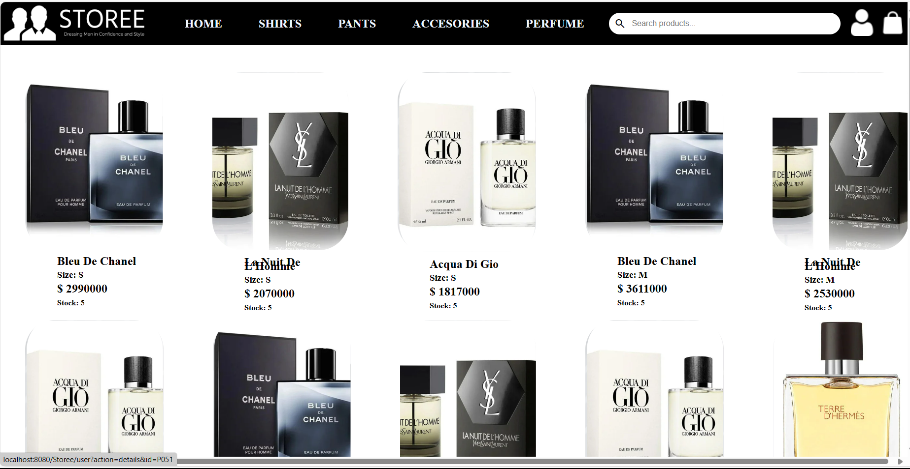
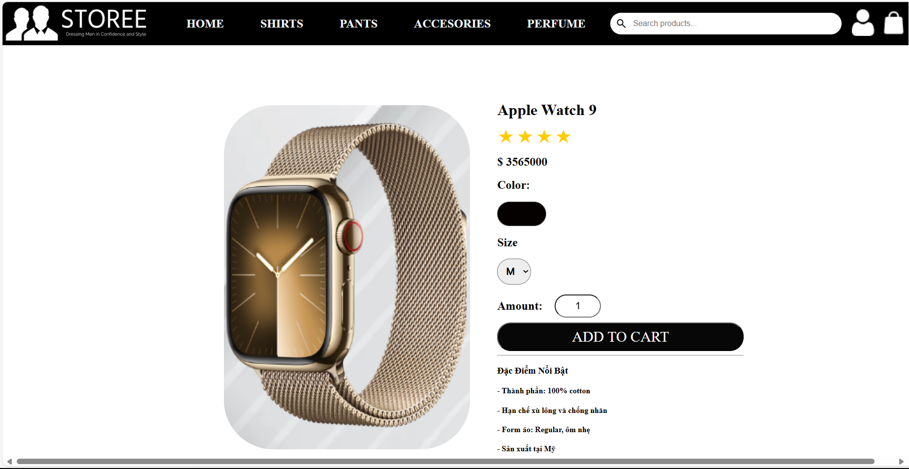
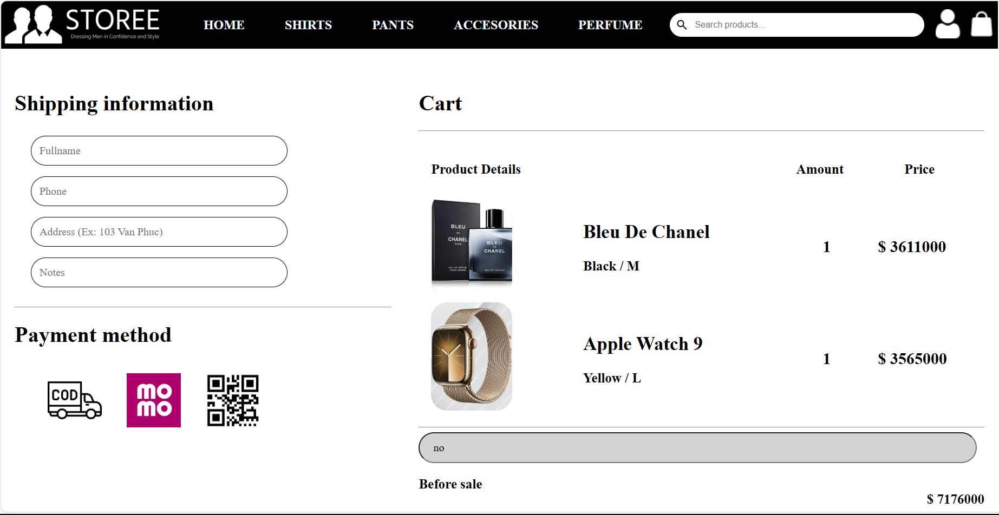
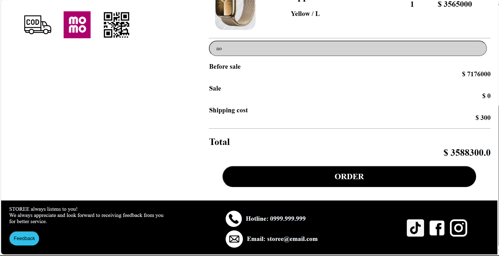

> Admin page
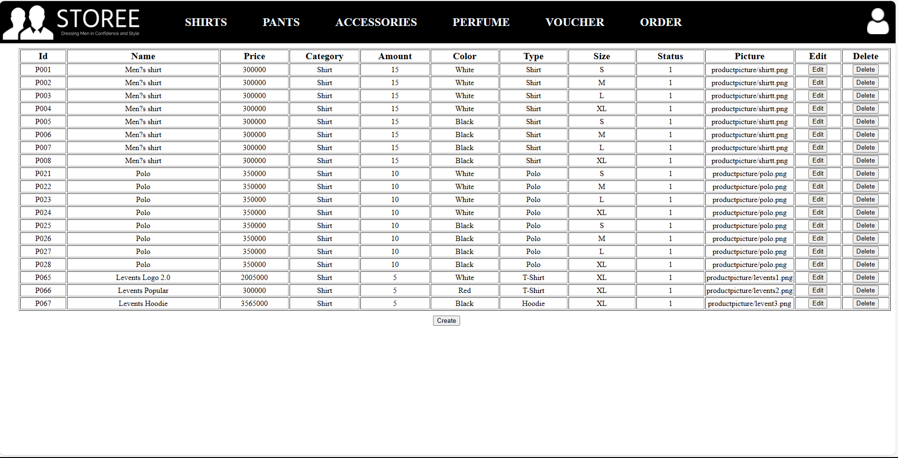
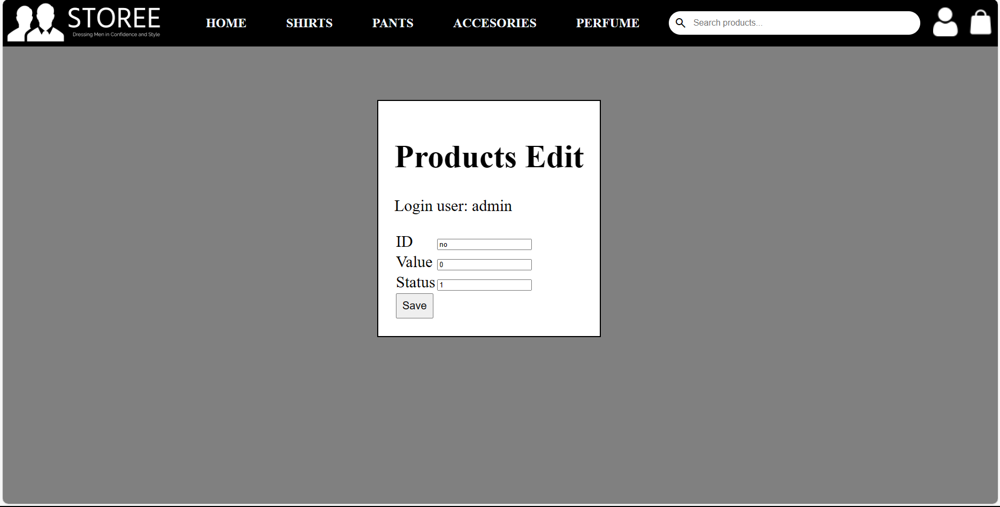

> ERD
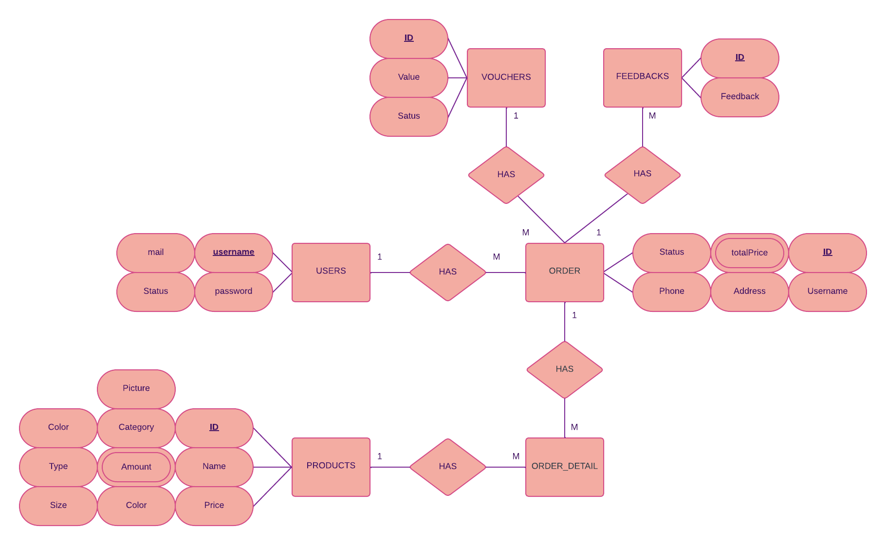

> Relations
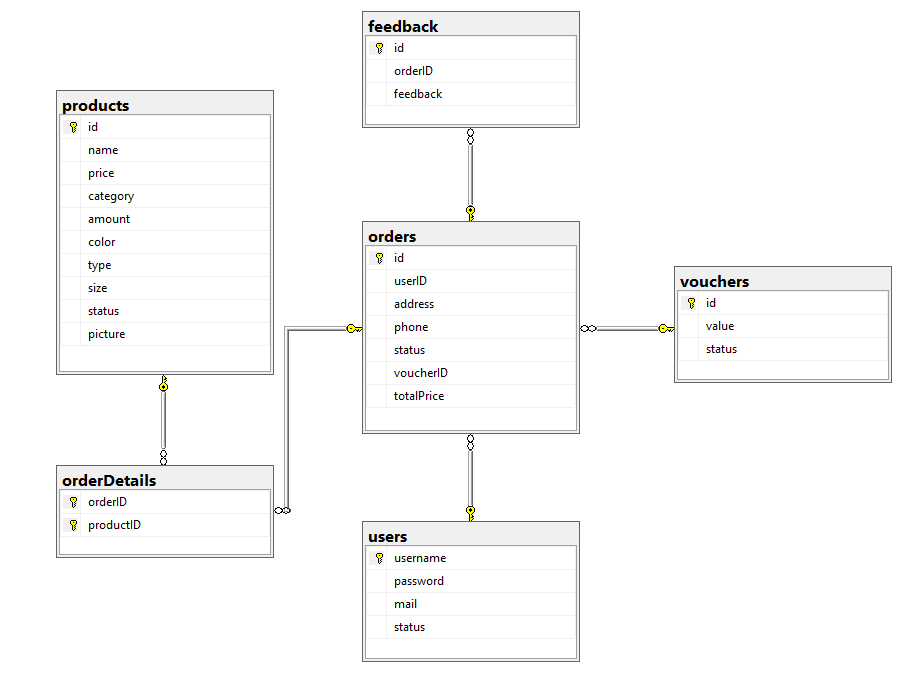

System design
1. Model Layer:
Product Model: Represents information about the product including id, name, price, description, etc.
Database Connector: Class that connects to the database to perform CRUD operations on the product table.
2. View Layer:
Product List View: Displays the product list.
Product Form View: Displays a form to add, edit or delete products.
3. Controller Layer:
ProductController: Handles requests related to products.
ListProducts: Get the list of products from the Model and pass it to the View to display.
ProductForm: Displays a form to add new products.
SaveProduct: Save new product information or update existing product information.
DeleteProduct: Delete the product from the database.

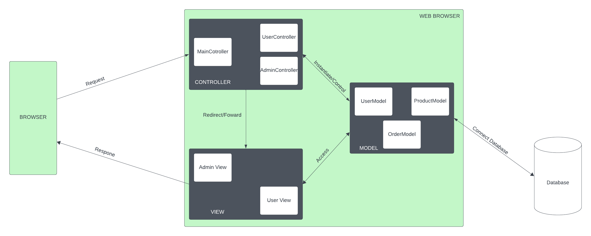

